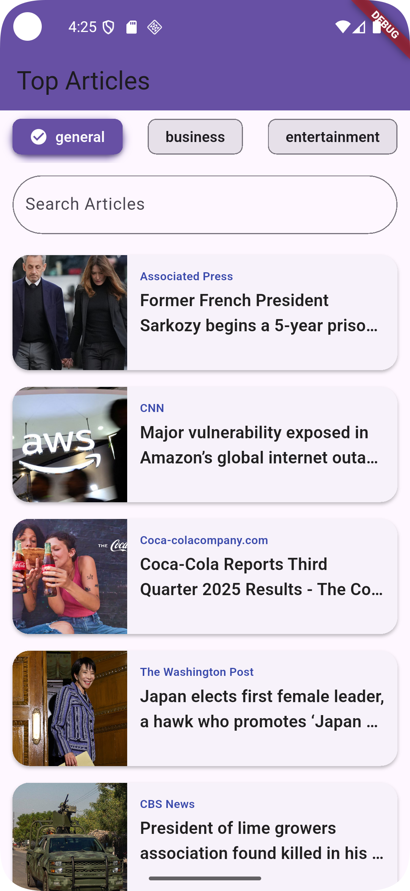
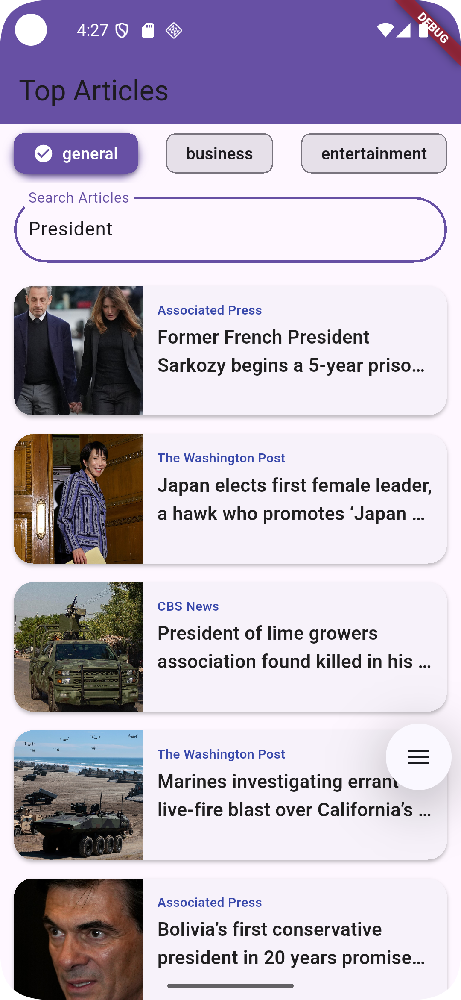
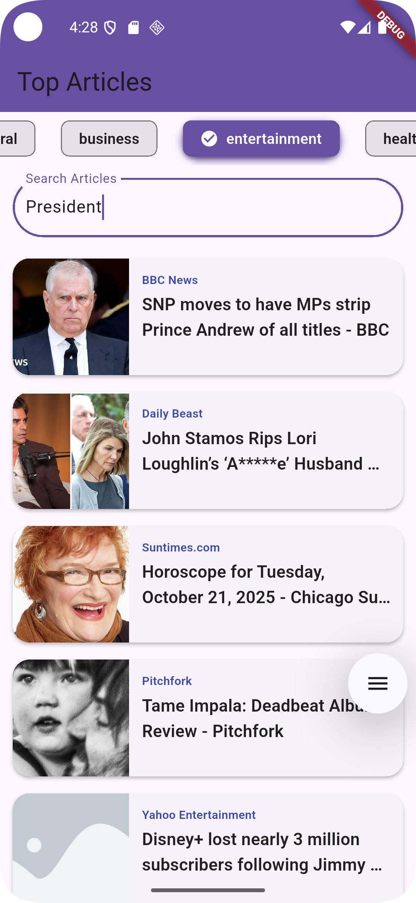
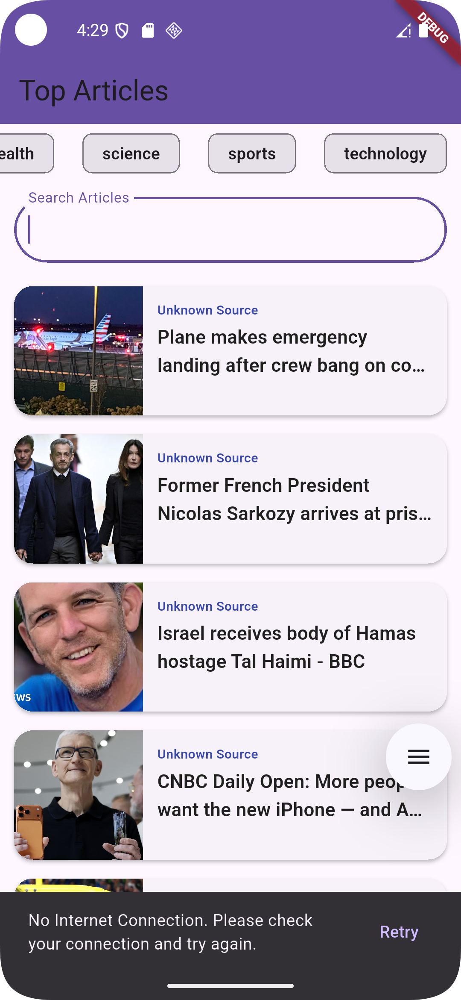
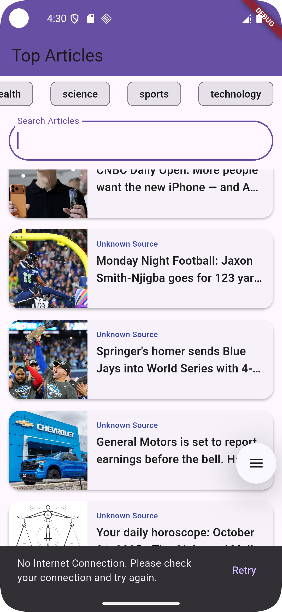

# 📱 News Mobile Application

A Flutter news application using clean architecture, Bloc state management, Dio (API) and Offline mode (Caching).


## 🏗️ Architecture

This application follows **Clean Architecture** principles with clear separation of concerns across three main layers:

### Architecture Layers

```
┌─────────────────┐
│   UI Screens    │
└─────────┬───────┘
          │
          |
          ▼
┌─────────────────┐
│       BLoC      │
└─────────┬───────┘
          │
          ▼
┌─────────────────┐
│    Use Cases    │
└─────────┬───────┘
          │
          ▼
┌─────────────────┐
│   Repository    │
└─────────┬───────┘
          │
          ├─────────────────┐
          │                 │
          ▼                 ▼
┌─────────────────┐ ┌─────────────────┐
│  Remote Data    │ │  Local Data     │
└─────────┬───────┘ └─────────┬───────┘
          │                   │
          ▼                   ▼
┌─────────────────┐ ┌─────────────────┐
│    NewsAPI      │ │  ObjectBox DB   │
└─────────────────┘ └─────────────────┘
```

**Data Flow:**
1. **UI Screens** → User interactions trigger events
2. **BLoC** → Manages state and handles events
3. **Use Cases** → Contains business logic
4. **Repository** → Central data access point
5. **Repository** branches to:
    - **Remote DataSource** → Fetches from **Dio API**
    - **Local DataSource** → Reads from **ObjectBox Database**

### Folder Structure

```
lib/
├── data/
│   ├── data_source/     # Remote & Local data sources
│   ├── dto/            # Data Transfer Objects
│   ├── repository/      # Repository implementation
│   └── transformer/    # Data transformation logic between domain, dto and entity models
├── domain/
│   ├── model/          # Domain models
│   └── usecase/        # Business logic use cases
├── ui/
│   └── screen/         # UI screens with BLoC
└── main.dart           # App entry point
```

## 🛠️ Technical Stack

### Core Technologies
- **Framework**: Flutter 3.8.1+
- **Language**: Dart
- **State Management**: flutter_bloc
- **Dependency Injection**: GetIt
- **Local Database**: ObjectBox

### Key Packages
- **State Management** `flutter_bloc` - Event-driven state management
- **Network**: `dio` - HTTP requests
- **Dependency Injection**: `get_it` - Manage dependency injection
- **Pagination**: `very_good_infinite_list` - Infinite scroll
- **Caching**: `cached_network_image` - Image caching
- **Connectivity**: `internet_connection_checker_plus` - Check Network connection
- **Search**: `rxdart` - Debounced search functionality
- **Sharing**: `share_plus` - Article sharing

## 🚀 Features Implementation

### 📰 News List Screen
- **Infinite Scroll Pagination**: Load more articles seamlessly
- **Pull-to-Refresh**: Manual refresh functionality
- **Category Filters**: Filter by news categories (General, Business, Sports, etc.)
- **Real-time Search**: Debounced search with instant results
- **Loading States**: Skeleton screens and loading indicators
- **Error Handling**: Network errors with retry options

### 📄 Article Detail Screen
- **Complete Article Info**: Title, author, description, image, published date
- **External Browser**: "Read Full Article" button opens in browser
- **Share Functionality**: Native sharing capabilities
- **Image Caching**: Optimized image loading and caching

### 🔄 Offline Mode
- **Automatic Detection**: Internet connectivity monitoring
- **Cached Articles**: Display previously loaded articles when offline
- **Smart Fallback**: Graceful degradation to cached content

### ⚠️ Error Handling
- **Network Errors**: No internet connection detection
- **API Errors**: Rate limiting and server error handling
- **Empty States**: User-friendly empty result messages
- **Retry Mechanisms**: One-tap retry for failed operations

## 📦 Deliverables

### 📱 APK Download
<!-- Add your APK download link here -->
[Download APK](https://drive.google.com/file/d/11hre4PUGenjwcVaDvrFlzPxOLYkvY0cr/view?usp=drive_link)

### 🎥 Video Demo
<!-- Add your video demo link here -->
[Watch Demo Video](https://drive.google.com/file/d/1NbEYJFgSP4dzGqY-oisL0M9cPzNq8TNt/view?usp=drive_link)

### 📸 Screenshots

| Feature | Screenshot | Description |
|----------|-------------|--------------|
| Home Screen |  | Main news list with categories and search |
| Article Details |  | Full article view with share options |
| Search Results |  | Real-time search functionality |
| Category Filter |  | Category-based news filtering |
| Offline Mode |  | Cached articles when offline |
| Error States |  | Network error handling with retry |